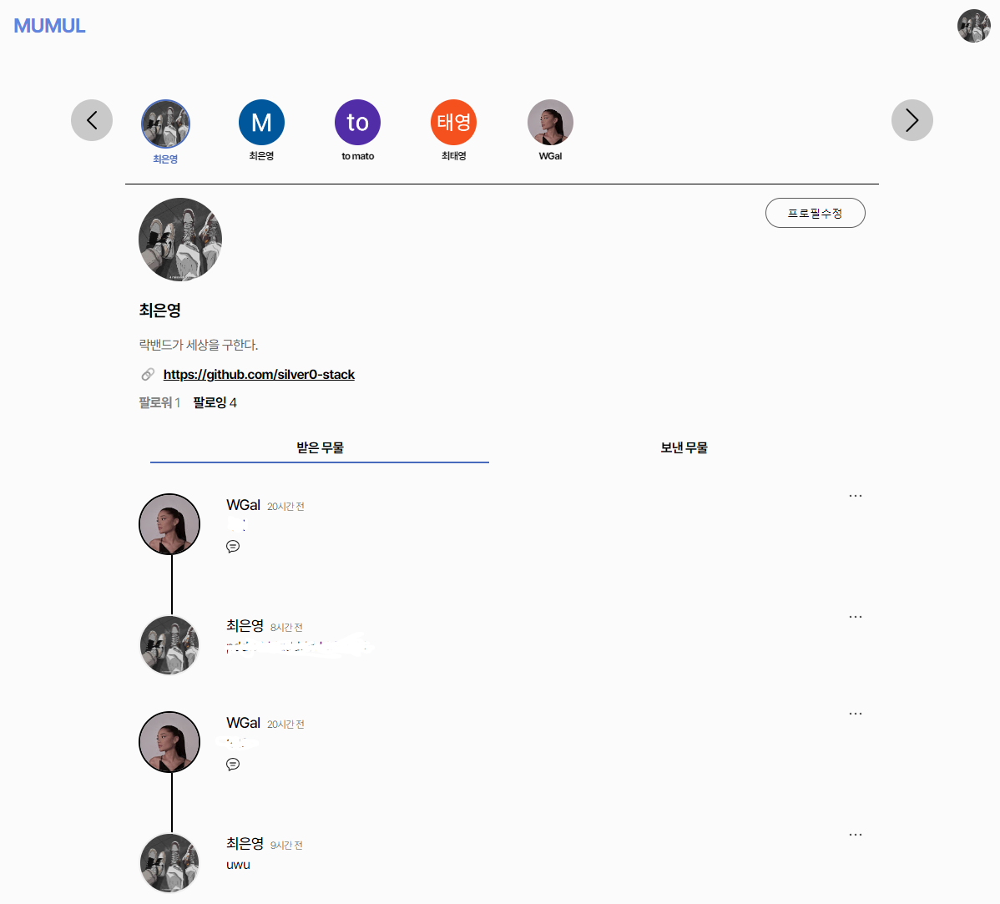

<!---->

  <strong style="color: grey;">☝️저의 MUMUL 스페이스입니다☝️</strong>

  

	

	

## 👨🏻‍💻 &nbsp;Currently Me:
🎉 &nbsp;[MUMUL(Ask Me Anything Service)](https://mumul.space) has been successfully deployed❗    

🤸‍♀️ &nbsp;Feel free to ask me anything in [my MUMUL space](https://mumul.space/11) :D

💌 &nbsp;If you want to contact MUMUL for anything, please contact us [here](https://mumul.space/19).

👩‍💻 &nbsp;I aim to be a `full-stack` developer, and really hope one day.

 

## 🛠️ &nbsp;Stack:
### &nbsp;Languages:

### &nbsp;Tech:

### &nbsp;Communication:

### &nbsp;Environment:

## 📈 Statistics

 

